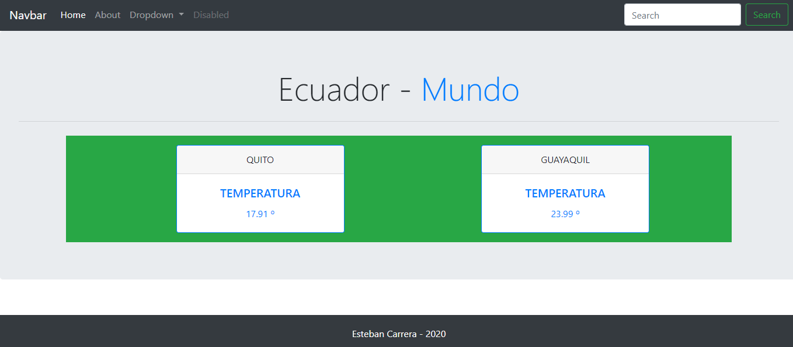
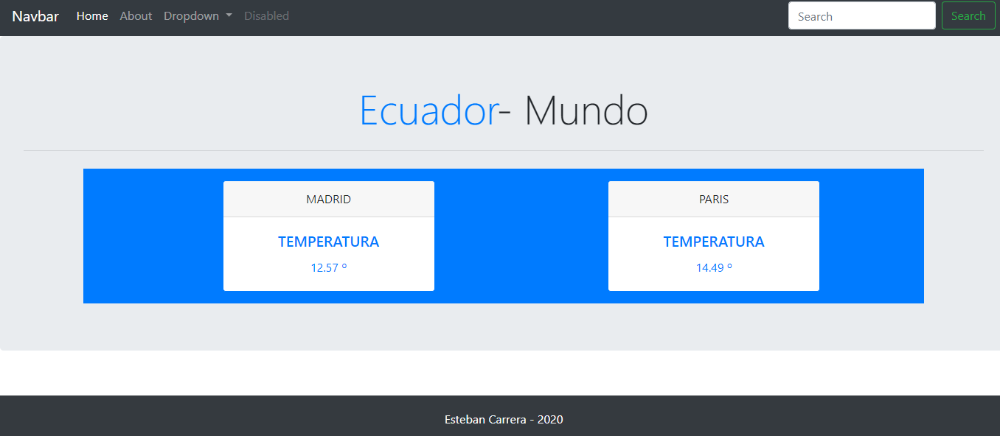

### Servidor Web + Express + HBS + axios
En esta aplicacion se creo un servidor web para poder obtener el clima en tiempo real
de 2 ciudades de Ecuador (Quito,Guayaquil) y 2 ciudades exteriores (Madrid, Paris)
---
Para esta aplicacion se tuvo que crear una cuenta en el servicio rapidapi y a su vez se necesito la obtencion de parametros
a traves del servicio openweather para medir el clima en dichas ciudades
--- 
Recuerda instalar las dependencias:

```
npm install
```

Para ejecutar:

```
npm start
```

Para ejecutar en navegador:

```
localhost:2000
```

EJECUCIÓN HOME

  

EJECUCIÓN ABOUT

  
